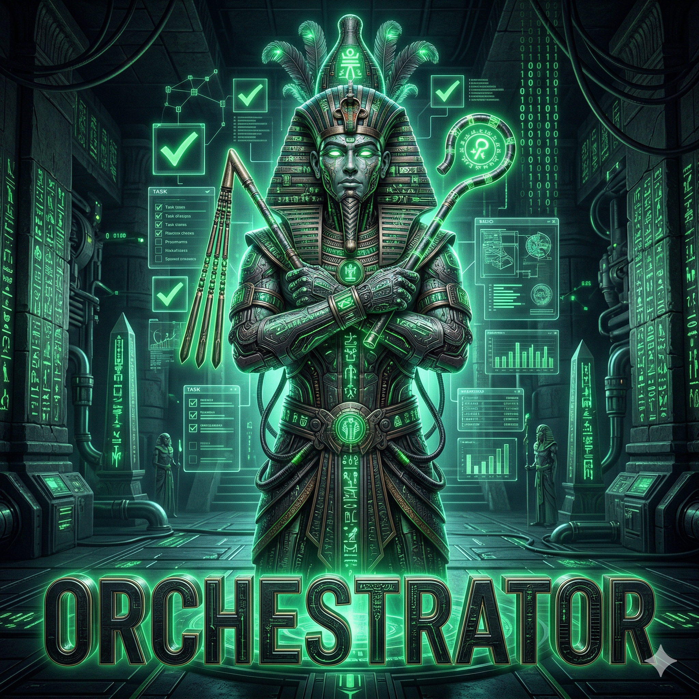
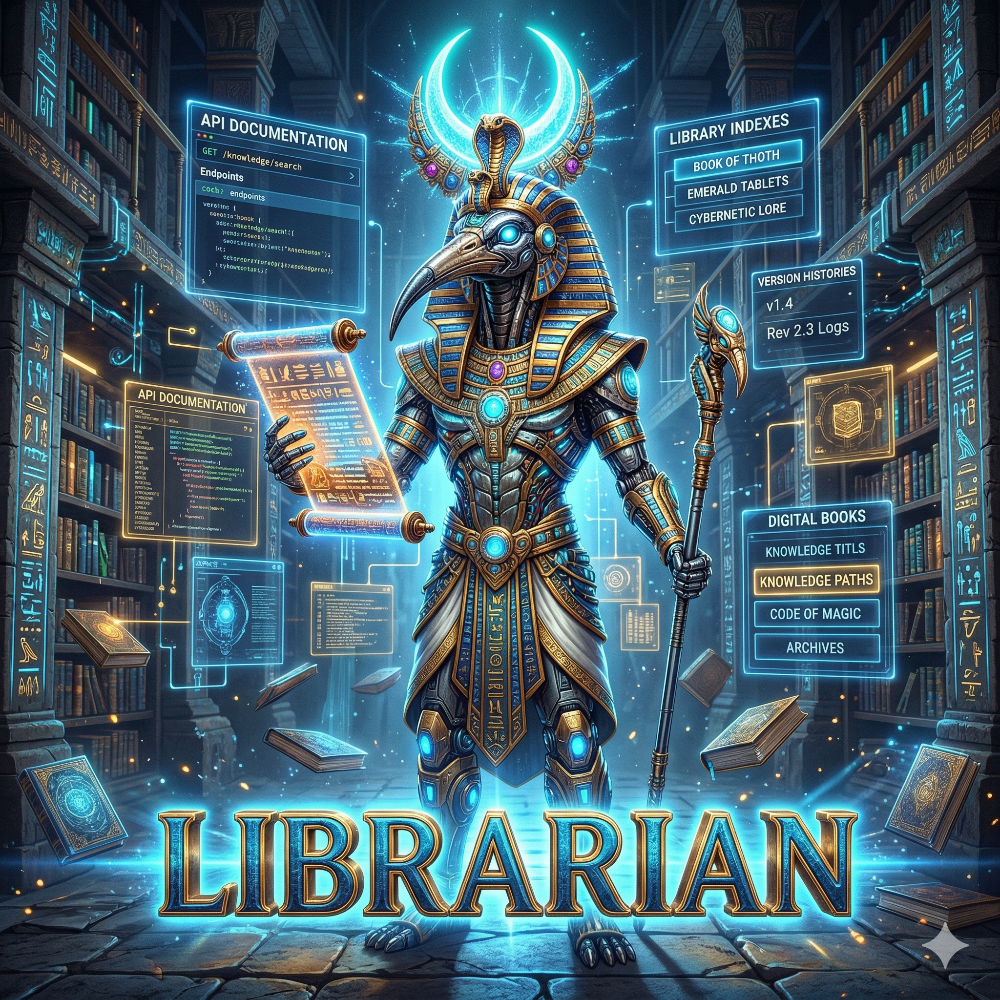
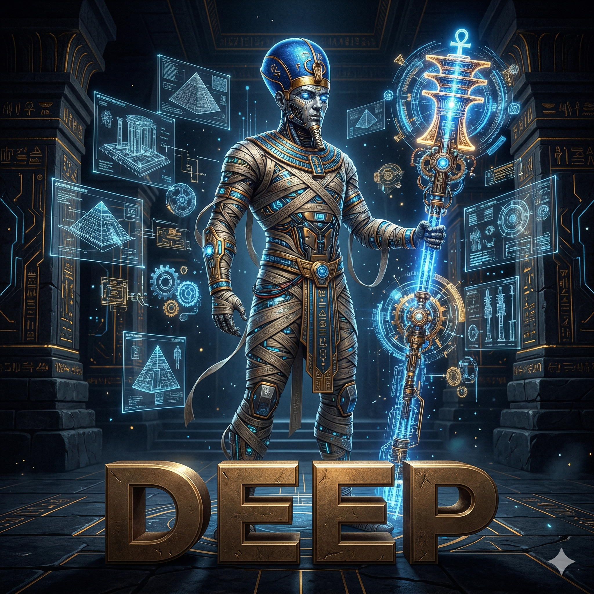

<div align="center">
  
  <p><i>Seven specialized agents, one delegate-first workflow across supported harnesses.</i></p>
  <p><b>thoth-agents</b> - Multi-harness orchestration - Thoth-mem persistence - Bundled SDD pipeline</p>
  <p>
    <a href="https://github.com/EremesNG/thoth-agents/actions/workflows/ci.yml"></a>
    <a href="https://www.npmjs.com/package/thoth-agents"></a>
    <a href="https://github.com/EremesNG/thoth-agents/blob/main/LICENSE"></a>
    
    
  </p>
</div>

---

thoth-agents is a delegate-first agent system for coding harnesses. It started
as an OpenCode plugin and now provides a shared seven-agent workflow for
OpenCode, Codex, and Claude Code, with each harness getting the integration
surface that fits it best.

OpenCode remains the stable default path: native plugin install, native `task`
delegation, optional tmux monitoring, and generated config. Codex is supported
through an explicit agent-pack and Personal plugin setup path, with documented
trust review and instruction-level governance caveats where Codex does not
provide the same hard runtime controls. Claude Code is a first-class path: a
single auto-discovered plugin package with native subagents, harness-enforced
hooks, MCP, skills, and per-agent tool permissions.

## What It Is

- A canonical seven-agent roster: `orchestrator`, `explorer`, `librarian`,
  `oracle`, `designer`, `quick`, and `deep`.
- A delegate-first operating model that keeps the root coordinator focused on
  decisions while specialists gather evidence, implement, review, and verify.
- A bundled requirements interview and SDD pipeline for moving from ambiguous
  requests to planned, verified implementation.
- A thoth-mem integration for durable project memory, SDD artifacts, and
  cross-session recovery.
- A multi-harness package that preserves OpenCode defaults while adding a
  Codex setup path.

## What It Is Not

- It is not a claim that every harness has identical runtime behavior.
- It is not a replacement for each harness's security, trust, sandbox, or
  approval model.
- It does not rename the seven roles or require new visual assets.
- It does not make Codex tmux-aware; tmux integration is scoped to OpenCode
  child `task` sessions.

## Harness Support

| Harness | Status | Setup path | Notes |
| --- | --- | --- | --- |
| OpenCode | Stable default | `npx thoth-agents@latest install` or `npx thoth-agents@latest install --agent=opencode` | Native plugin config, native `task` delegation, optional tmux panes, OpenCode provider auth. |
| Codex | Supported explicit path | `npx thoth-agents@latest install --agent=codex` | Installs ambient/root guidance, six role subagents, and a Personal plugin source. Requires `/plugins` and `/hooks` trust review. Some governance remains instruction-level. |
| Claude Code | Supported first-class path | `npx thoth-agents@latest install --agent=claude` | Installs one Claude Code plugin: six specialist subagents (`Task(subagent_type: ...)`), an `orchestrator` agent activated as the main thread via `settings.json`, `.mcp.json`, and bundled skills. Role permissions are enforced by subagent `tools`. |

OpenCode can load the plugin with:

```jsonc
{
  "plugin": ["thoth-agents@latest"]
}
```

That plugin entry is not a shell command. To run the installer or TUI, use the
npm binary through a global install, `npx thoth-agents@latest`, or
`pnpm dlx thoth-agents@latest`.

## Quick Start

Run the binary with no arguments in an interactive terminal to open the
multi-harness TUI:

```bash
npx thoth-agents@latest
```

The same no-argument binary invocation falls back to the OpenCode install path
in CI, redirected, or `TERM=dumb` terminals. Use explicit commands when you
need deterministic automation.

### OpenCode

```bash
npx thoth-agents@latest install
npx thoth-agents@latest install --agent=opencode
opencode auth login
opencode
```

Then ask OpenCode to verify the roster:

```text
ping all agents
```

For non-interactive setup:

```bash
npx thoth-agents@latest install --no-tui --tmux=no --skills=yes
```

Interactive status, list, update, sync, and model previews are available from
the no-argument TUI. Command help also documents the explicit command names for
terminal workflows.

### Codex

Review the plan first, then install explicitly:

```bash
npx thoth-agents@latest install --agent=codex --dry-run
npx thoth-agents@latest install --agent=codex
```

Restart Codex and review plugin/hook trust:

```text
/plugins
/hooks
```

Codex install does not create a selectable orchestrator TOML, does not bypass
trust review, and does not make role permissions or memory governance hard
runtime guarantees unless Codex exposes those controls.

### Claude Code

Preview, then install the plugin package:

```bash
npx thoth-agents@latest install --agent=claude --dry-run
npx thoth-agents@latest install --agent=claude
```

This writes a single Claude Code **skills-directory plugin** under
`~/.claude/skills/thoth-agents`: `.claude-plugin/plugin.json`, seven
auto-discovered agents in `agents/` (six specialists + an `orchestrator`), an
`.mcp.json` server map, bundled `skills/`, and a plugin-root `settings.json`
with `{ "agent": "orchestrator" }`. That `agent` key activates the orchestrator
as the **main thread** — replacing the default system prompt — so the session
starts in delegate-first mode and bootstraps thoth-mem on its first turn. It
auto-loads as `thoth-agents@skills-dir` on the next session (no marketplace or
install step); restart Claude Code or run `/reload-plugins` to activate it
(confirm in `/plugin` → Installed). The orchestrator delegates to specialists
with `Task(subagent_type: explorer|librarian|oracle|designer|quick|deep)`. Role
permissions are enforced through each specialist's frontmatter `tools` allowlist.
You can also emit the package without installing it:

```bash
npx thoth-agents@latest generate --harness=claude --dry-run
```

See [docs/claude-code-plugin-packaging.md](docs/claude-code-plugin-packaging.md).

### Reset Generated Config

```bash
npx thoth-agents@latest install --reset
```

## Seven-Agent Roster

The delegate-first philosophy is simple: the `orchestrator` coordinates while
specialists execute. Shared concepts are the same across harnesses, but the
dispatch mechanism is harness-bound. In OpenCode, specialists are launched with
the native `task` tool. In Codex, the installed role agents and plugin-bundled
skills provide the closest supported workflow, with some behavior enforced by
instructions rather than hard runtime APIs.

### Primary Agent

<table width="100%">
  <tr>
    <td width="100%" valign="top">
      
      <br>
      <b>Orchestrator</b>
      <br>
      <i>Root coordinator and sole primary agent.</i>
      <br><br>
      <b>Role:</b> The root coordinator. Handles delegation, sequencing, memory ownership, requirements routing, and SDD progress tracking. Does not read or modify source files directly when running as the root coordinator.
      <br>
      <b>Mode:</b> primary, non-mutating
      <br>
      <b>Dispatch:</b> sync coordinator
      <br>
      <b>Recommended:</b>
      <br>
      <code>anthropic/claude-opus-4-6</code> - <code>openai/gpt-5.4</code> - <code>kimi-for-coding/k2p5</code>
      <br>
      <b>Personality:</b> Autonomous deep coordinator; owns decisions and works through specialists.
    </td>
  </tr>
</table>

### Specialist Subagents

<table width="100%">
  <tr>
    <td width="33%" valign="top">
      
      <br>
      <b>Explorer</b>
      <br>
      <i>Fast local discovery.</i>
      <br><br>
      <b>Role:</b> Local codebase discovery and navigation. Finds files, symbols, references, constraints, and verification targets.
      <br>
      <b>Mode:</b> read-only
      <br>
      <b>Dispatch:</b> harness-bound specialist dispatch
      <br>
      <b>Recommended:</b>
      <br>
      <code>Grok Code Fast</code> - <code>openai/gpt-5.4-nano</code> - <code>anthropic/claude-haiku-4-5</code>
    </td>
    <td width="33%" valign="top">
      
      <br>
      <b>Librarian</b>
      <br>
      <i>External docs and examples.</i>
      <br><br>
      <b>Role:</b> External docs and API research. Validates version-specific behavior with official docs or public examples.
      <br>
      <b>Mode:</b> read-only
      <br>
      <b>Dispatch:</b> harness-bound specialist dispatch
      <br>
      <b>Recommended:</b>
      <br>
      <code>openai/gpt-5.4</code> - <code>anthropic/claude-sonnet-4-6</code> - <code>google/gemini-3.1-pro-preview</code>
    </td>
    <td width="33%" valign="top">
      
      <br>
      <b>Oracle</b>
      <br>
      <i>Deep review and diagnosis.</i>
      <br><br>
      <b>Role:</b> Strategic advisor for debugging, architecture review, code review, security/correctness risk, and SDD plan review.
      <br>
      <b>Mode:</b> read-only
      <br>
      <b>Dispatch:</b> synchronous advisory specialist
      <br>
      <b>Recommended:</b>
      <br>
      <code>openai/gpt-5.4</code> - <code>anthropic/claude-opus-4-6</code> - <code>opencode-go/glm-5</code>
    </td>
  </tr>
  <tr>
    <td width="33%" valign="top">
      
      <br>
      <b>Designer</b>
      <br>
      <i>UI, UX, frontend, and visual QA.</i>
      <br><br>
      <b>Role:</b> User-facing design and implementation. Owns visual decisions, browser checks, screenshots, and UX quality.
      <br>
      <b>Mode:</b> write-capable
      <br>
      <b>Dispatch:</b> synchronous implementation specialist
      <br>
      <b>Recommended:</b>
      <br>
      <code>google/gemini-3.1-pro-preview</code> - <code>opencode-go/glm-5</code> - <code>kimi-for-coding/k2p5</code>
    </td>
    <td width="33%" valign="top">
      
      <br>
      <b>Quick</b>
      <br>
      <i>Fast bounded implementation.</i>
      <br><br>
      <b>Role:</b> Narrow, mechanical, low-risk edits where the approach is already clear.
      <br>
      <b>Mode:</b> write-capable
      <br>
      <b>Dispatch:</b> synchronous implementation specialist
      <br>
      <b>Recommended:</b>
      <br>
      <code>openai/gpt-5.4-mini</code> - <code>anthropic/claude-haiku-4-5</code> - <code>google/gemini-3-flash-preview</code>
    </td>
    <td width="33%" valign="top">
      
      <br>
      <b>Deep</b>
      <br>
      <i>Thorough implementation and verification.</i>
      <br><br>
      <b>Role:</b> Correctness-critical, multi-file, edge-case-heavy implementation and verification.
      <br>
      <b>Mode:</b> write-capable
      <br>
      <b>Dispatch:</b> synchronous implementation specialist
      <br>
      <b>Recommended:</b>
      <br>
      <code>openai/gpt-5.4</code> - <code>anthropic/claude-opus-4-6</code> - <code>google/gemini-3.1-pro-preview</code>
    </td>
  </tr>
</table>

## SDD And Memory

The bundled requirements interview is the front door for open-ended work. It
clarifies intent, assesses scope, asks for user approval when needed, and routes
work into direct implementation, accelerated SDD, or full SDD.

```text
propose -> spec -> clarify -> design -> tasks -> apply -> verify -> archive
```

For moderate work, the accelerated path usually runs `propose -> tasks`. For
high-risk or high-complexity work, the full path adds specification and design
artifacts before task execution.

Artifacts can be persisted in four modes:

| Mode | Writes to | Cost | Use when |
| --- | --- | --- | --- |
| `thoth-mem` | Memory only | Low | Fast iteration without repo planning files |
| `openspec` | `openspec/` files only | Medium | Reviewable planning artifacts in the repo |
| `hybrid` | Both | High | Maximum durability; default |
| `none` | Neither | Lowest | Ephemeral iterations, no persistence |

Thoth-mem is the local memory MCP used for durable observations, architectural
decisions, SDD artifacts, and session summaries. The core retrieval pattern is:

1. `mem_recall(mode="compact")` for compact candidate records
2. `mem_recall(mode="context")` for expanded retrieved context
3. `mem_get(...)` for the full selected record; use
   `mem_get(include_timeline=true)` when chronology matters

Use HyDE/fused hybrid recall (sentence + chunk vectors, FTS, KG enrichment) for
semantic or ambiguous searches; set `mem_recall` `limit` from 1 to 20; narrow
with `topic_key`, `type`, `time_from`, `time_to`, `scope`, `project`, and
`session_id` filters. Use `mem_get` with `kind="observation"|"prompt"`,
`include_timeline=true` plus `before`/`after`, and `offset`/`max_length` for
large content. Use bounded `mem_context(recall_query=...)` or
`mem_project(action="graph"|"topics"|"topic")` for supplemental project
context; `mem_project(action="graph")` relations are `HAS_TYPE`, `IN_PROJECT`,
`HAS_TOPIC_KEY`, `HAS_WHAT`, `HAS_WHY`, `HAS_WHERE`, and `HAS_LEARNED`.

## Skills And MCPs

thoth-agents ships bundled skills for requirements discovery, plan review, SDD
planning/execution, verification, and archiving. It also registers MCP servers
for docs research, public code search, and local memory where the harness
supports that delivery surface.

| Surface | Shared concept | OpenCode binding | Codex binding | Claude Code binding |
| --- | --- | --- | --- | --- |
| Skills | Requirements, SDD, review, execution workflows | Copied into the OpenCode skills directory when `--skills=yes` | Packaged as plugin-bundled skills for the Personal plugin source | Bundled in the plugin `skills/` directory |
| MCPs | `exa`, `context7`, `grep_app`, `thoth_mem` | Registered by generated OpenCode plugin config | Packaged/configured only on validated Codex surfaces | Bundled in the plugin `.mcp.json` (`type: "http"` for URL servers) |
| Delegation | Seven-role specialist workflow | Native `task` tool | Custom agents plus prompt/plugin guidance | Native `Task(subagent_type: ...)` over auto-discovered subagents |
| Blocking choices | Use a structured question surface | OpenCode `question` tool | `request_user_input` when enabled and available | `AskUserQuestion` tool |

See [docs/skills-and-mcps.md](docs/skills-and-mcps.md) for the detailed matrix.

## Documentation

- [Installation](docs/installation.md): OpenCode default setup, explicit Codex
  setup, non-interactive installs, reset behavior, and troubleshooting.
- [Codex Install](docs/codex-install.md): Codex targets, backups, dry-run
  behavior, trust review, and limitations.
- [Quick Reference](docs/quick-reference.md): Agent roster, SDD flow, memory,
  delegation, tmux, and key config fields.
- [Skills and MCPs](docs/skills-and-mcps.md): Bundled skills, MCP servers, and
  harness delivery surfaces.
- [Provider Configurations](docs/provider-configurations.md): OpenCode provider
  presets, fallback chains, and Codex customization cross-links.
- [Tmux Integration](docs/tmux-integration.md): OpenCode-scoped live pane
  monitoring for delegated `task` sessions.
- [SDD Pipeline](docs/sdd-pipeline.md): Planning and execution workflow details.
- [Codex Plugin Packaging](docs/codex-plugin-packaging.md): Codex plugin package
  layout and packaging boundaries.
- [Codex Surface Validation](docs/codex-surface-validation.md): Validated,
  unknown, and unsupported Codex generation surfaces.
- [Codex Model Customization](docs/codex-model-customization.md): Codex role
  model defaults and customization limits.

## Development

The OpenCode integration targets `@opencode-ai/plugin` and
`@opencode-ai/sdk` v1.4.7. The repository also contains Codex adapter and
packaging code for the multi-harness install path.

Use Node.js `>=22.13` with Corepack-managed `pnpm@11.2.2`:

```bash
corepack enable
corepack prepare pnpm@11.2.2 --activate
pnpm install
```

| Command | Purpose |
| --- | --- |
| `pnpm run build` | Build TypeScript into `dist/` and generate declarations/schema |
| `pnpm run typecheck` | Run TypeScript type checking without emit |
| `pnpm test` | Run the Vitest suite |
| `pnpm run lint` | Run Biome linter |
| `pnpm run format` | Run Biome formatter |
| `pnpm run check` | Run Biome check with auto-fix |
| `pnpm run check:ci` | Run Biome check without writes |
| `pnpm run dev` | Build and launch the OpenCode plugin in local dev mode |

## License

MIT
