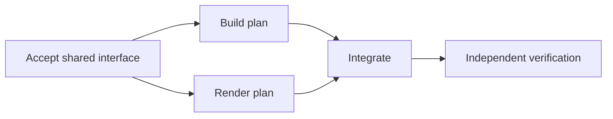

# AI-first work workflow

Thoth classifies requests before choosing a process. Questions and research do
not automatically authorize changes. For substantive changes, explore current
behavior, specify the desired outcome, and clarify material uncertainty before
technical planning. Only then persist the agreement and execution evidence in
`.thoth/changes/<id>/work.yaml`. The human owns the goal, acceptance criteria,
material decisions, and autonomy bounds. The two planning choices
below control review and execution. Their resolved answers are reused during
execution and recovery; other questions concern unresolved decisions outside
that agreement. The two bounded defaults never resolve those other decisions.

Small, clear, bounded, low-risk work can use focused implementation and
proportional verification without planning files. Specialists implement by
default; delegation or unit count alone does not require persistence. Root direct
work is limited to consulting one known source or making a minimal authorized
low-risk edit when source, scope and verification are known and no discovery or
independent judgment is needed. Another search or dependency ends that exception.
Use a work contract for nontrivial or risky changes, coordination needing a durable
agreement, or resumable work. Reclassify before expanding work if material
uncertainty, broader scope, or risk emerges; preserve useful progress. There are
no Direct/Accelerated/Full artifact bundles or mandatory prose reports.

## What is persisted

| File | Purpose | When needed |
| --- | --- | --- |
| `work.yaml` | Goal, agreement, scope, autonomy, acceptance, units and accepted results | Persisted work |
| `context/<topic>.md` | Findings or rationale that a named unit needs | Only when the contract alone is insufficient |
| `units/<id>.yaml` | One external unit definition | Instead of inline units when splitting improves selective reads |
| `evidence/<id>/checkpoint.json` | Last observed progress, input/output fingerprints, checks, remaining action | Executing units that need recovery |
| `evidence/<artifact>` | A concrete test, review, or outcome result | When durable evidence is useful |
| `evidence/planning.json` | Root-owned choices, unanswered counts, native references and approval identity | Persisted planning choices and their recovery |

A unit exists inline or externally, never both. References are repository-root
relative. The contract is versioned in Git; unsaved work and a corrupt disk are
outside its recovery guarantees. Root owns the agreement and acceptance state.
Each specialist owns its product surface and its own unit checkpoint only.

The installed `thoth-work` skill supplies a minimal example, optional variants,
an offline validator, and bounded context/fingerprint/checkpoint helpers. The
helpers never execute commands declared in YAML and never schedule agents.

## Before planning

| Step | Required outcome |
| --- | --- |
| Classify | Identify request type, scope, uncertainty, risk, coordination and recovery needs with bounded inspection. |
| Explore | Ground current behavior, relevant contracts, tests, interfaces and constraints in repository evidence; expose unknowns. |
| Specify | Define desired observable behavior, inclusions/exclusions, measurable acceptance and autonomy, not implementation tasks. |
| Clarify | Separate facts, assumptions and human-owned decisions; resolve material uncertainty rather than silently adopting guesses. |
| Plan and persist | Shape outputs, dependencies, ownership, resources and checks, then save the agreed result in `work.yaml`. |

Repository facts should be investigated rather than asked of the user. Unknown
local source, flow or responsibility goes to Explorer before root repository
search; its bounded assignment may name an unknown location and does not require
exploratory pre-reading. Known bounded implementation goes straight to designer
or worker without a mandatory Explorer stage. Use `architectural-grilling`
only on explicit request or for unresolved material human-owned product or
architecture decisions, not as a mandatory interview. Reuse settled decisions.
Discovery can iterate: uncertainty affecting intent, acceptance, approach or
authorization blocks readiness; bounded technical unknowns need an explicit
resolution strategy and a stop/replan condition.

These are semantic exit conditions, not new mandatory documents or an automatic
state machine. Existing agreement fields, decisions, units and optional context
hold only the findings consumers need. See [planning readiness and choices](../skills/thoth-work/references/planning.md)
for the operational procedure. The structural validator cannot prove exploration
or clarification actually happened.

## Planning and execution

1. After the readiness conditions above hold, root records the agreed goal,
   inclusions/exclusions, decisions, autonomy and measurable acceptance. Current product contracts remain in `.thoth/specs/`;
   project principles live in `.thoth/constitution.md`.
2. Root shapes near-term work into units with an output, concrete dependencies,
   read inputs, owned write paths, shared resources, owner and checks. Later
   units may be refined as evidence becomes available within the agreement.
3. The `ready` validator checks structure, references, coverage and agreement
   freshness. It cannot establish semantic correctness or user authorization.
4. Root summarizes the ready plan and offers **Review plan with Oracle
   (Recommended)** or **Implement directly**. The user decides. Selected review
   uses a fresh read-only Oracle through plan-reviewer. Repair [REJECT] blockers
   and use a fresh judgment. After [OKAY], summarize the plan and ask **Implement
   (Recommended)** or **Stop with approved plan**, even if the overall objective
   was already authorized. Stop preserves the plan without implementing.
5. After resolving the applicable choices, root dispatches independent units
   through native harness tools. A
   child receives its unit, relevant agreement clauses, dependency outputs and
   selected context. It does not receive the entire history by default.
6. Native terminal output is reconciled against scope, actual changes and fresh
   checks. Root accepts a useful output before a dependent unit consumes it.
7. A fresh read-only Oracle verifies persisted work against the actual agreement,
   diff and evidence. Test success alone is insufficient. Root records the
   verdict and acceptance results, then validates `closeout` and archives.

Each question has at most **three total native attempts**. After its third
confirmed unanswered return, use its recommendation: Oracle review first,
implementation after [OKAY]. Explicit answers always win. An open question,
unavailable UI/tool, transport failure, interruption or elapsed time does not
count as a returned unanswered attempt. Native retry restrictions still apply.
Never fabricate attempts or use these defaults for secrets, sensitive actions or
new material decisions.

Root keeps only compact decision evidence, including native references and the
reviewed plan identity. Resume retains explicit and fallback choices, Stop and
remaining attempts. Material changes to a reviewed plan need fresh review and
a new implementation choice; ordinary implementation edits do not reopen it.
See [planning choices](../skills/thoth-work/references/planning.md) for the bounded
recovery procedure. This is instruction-level policy; the offline work validator
does not authenticate question responses. A writer never approves its own result.

## Parallelism

U1 and U2 may run concurrently only if their write surfaces, read assumptions,
interfaces and shared resources are compatible. Disjoint filenames alone do not
prove independence. Root fills proven native capacity before waiting and refills
released capacity before another wait. Each consumer is released when its own
upstream outputs are accepted and fresh; there is no global wave barrier.

The harness owns dispatch, status, waiting, steering, cancellation, terminal
results and capacity. Thoth supplies policies and bounded artifacts, without a
scheduler, job database, lifecycle mirror or invented universal wait API. A
missing native capability is reported and uses a truthful sequential fallback.
Worktree creation, automatic merging and conflict orchestration are deferred.

## Recovery

Before execution, capture relevant inputs and the owned workspace baseline,
including preexisting edits. A missing prior baseline stays explicitly unknown;
capturing current files after editing cannot reconstruct it. Save a checkpoint at useful semantic boundaries,
not every edit and not only when finishing. It records assignment identity,
progress, checks against exact content, remaining work and the next bounded
read/action. Its latest valid predecessor is kept as a bounded fallback.

When asked to continue, root loads the agreement, selected unit and its required
dependency closure, relevant context and checkpoints,
queries native liveness, checks current owned files and changed dependencies,
and invalidates stale evidence. Changes to unit definitions or checks invalidate
their accepted results even when file contents are unchanged. Final verification
also binds the current agreement and technical plan. Accepted unaffected work remains accepted;
partial useful work and unrelated user edits are preserved. A checkpoint is an
observation, never native completion or acceptance.

If the old writer might still be alive, block only the conflicting surface until
native completion/cancellation or confirmation that the former environment has
stopped resolves it. Timeout and silence do not authorize a duplicate writer.
Continue independent work meanwhile. Reconcile external side effects before
retrying them; this protocol does not promise exactly-once execution or a
transaction covering code and its checkpoint.

## Durable contracts and closeout

`durableUpdates` declares explicit capability-file additions, replacements,
removals or renames under `.thoth/specs/<capability>/spec.md`. A replacement,
removal or rename requires the expected SHA-256 of the existing file; additions
must not overwrite a file. Full replacement content must preserve any unaffected
requirements, assessed by independent review. Undeclared files are untouched.

The archive helper requires native writers to be terminated, acquires the single
atomic `.thoth/.archive-transaction/` directory, validates current evidence, and
moves existing durable files to backup before checking the captured content.
New versions use exclusive installation so the verified file race cannot clobber
a concurrent write; detected races retain backups for inspection. Arbitrary
concurrent changes to surrounding directory topology remain outside this
guarantee. Forced process/OS termination is not atomic; inspect
`.thoth/.archive-transaction/recovery.json` and its retained backups before
retrying. On success the change moves to
`.thoth/changes/archive/<date>-<id>/`. Archived repository-relative references
retain their original basis as historical provenance; the archive path maps the
former change root to its new location.

The repository's former OpenSpec change history is preserved under
`.thoth/history/openspec/`, excluded from routine execution context. Old active
specifications were moved to `.thoth/specs/`; this migration replaces the active
workflow contract while retaining unrelated durable product behavior.

## Verification limits

Automated checks exercise malformed contracts, selective context, stale evidence,
checkpoint fallback, closeout and packaged instructions. Native multi-agent
execution is observed separately: rendered prompts do not prove that every
harness or model will follow them. Efficiency and token savings require measured
pilot runs and are not asserted by this change.
