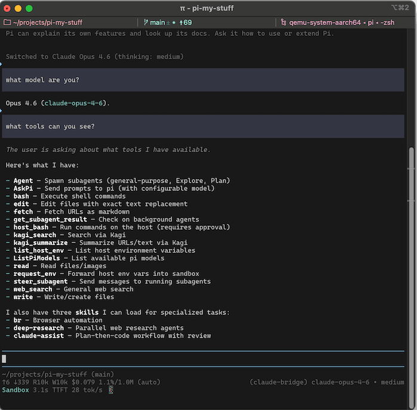
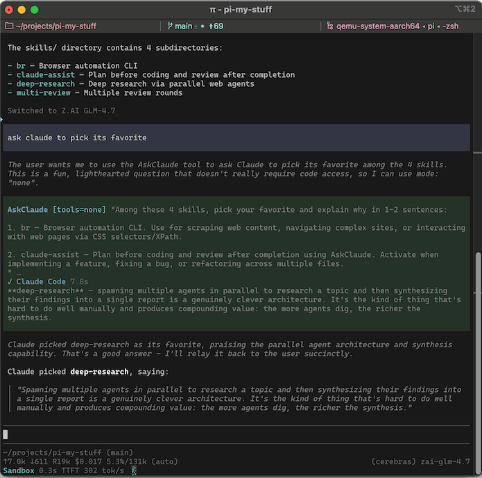

# @thoth-agents/pi-claude-bridge

[](https://www.npmjs.com/package/@thoth-agents/pi-claude-bridge)

Pi extension that integrates Claude Code via the [Agent SDK](https://github.com/anthropics/claude-agent-sdk-typescript). Originally based on [claude-agent-sdk-pi](https://github.com/prateekmedia/claude-agent-sdk-pi) by Prateek Sunal.

1. **Provider** — Use Opus/Sonnet/Haiku as models in pi, with all tool calls flowing through pi's TUI
2. **AskClaude tool** — Delegate tasks or questions to Claude Code when using another provider


**FYI:** Anthropic [announced and then unannounced](https://support.claude.com/en/articles/15036540-use-the-claude-agent-sdk-with-your-claude-plan) a change to how you would be billed for tools that use the Agent SDK like this one. It currently uses your regular subscription quota just like Claude Code.

<p>
<a href="assets/claude-bridge1.png"></a>&nbsp;
<a href="assets/claude-bridge2.png"></a>
</p>

## Install

```
pi install npm:@thoth-agents/pi-claude-bridge
```

Requires Pi `>=0.99.0` and Node `>=22.19.0`. Development Pi SDK/TUI
dependencies are pinned to `1.0.2` in the root workspace lockfile.

## Provider

Use `/model` to select any Claude model in pi-ai's catalog, e.g. `claude-bridge/claude-fable-5-1`, `claude-bridge/claude-opus-5`, or `claude-bridge/claude-haiku-4-5`.

Behind the scenes, pi's tools are bridged to Claude Code but everything works like normal in pi. Bash commands get Claude Code's 120-second default timeout since pi's bash has none. Skills are forwarded to Claude Code's system prompt, and steering mid-turn reaches Claude at the next tool boundary.

**Dynamic appended instructions:** On a resumed provider query, only added or changed projected append blocks (extension instructions, context files, or skills), plus removed block keys, are sent through query-scoped `UserPromptSubmit` hook context. The delimited update supersedes the same-keyed earlier blocks; unlisted blocks remain in effect. This includes restoration to a previous value and removal of all appended instructions. Unchanged content adds nothing. Blocks are line-start XML-like elements keyed by tag and optional `path`/`name`, comment regions (`<!-- name:start -->`…`<!-- name:end -->`), and ordinal free-text runs. The `project_context` wrapper and its immediate children are keyed independently, so changing one `project_instructions` file does not resend the others. Duplicate keys, unbalanced boundaries, or reordered retained blocks trigger a full replacement instead of a potentially misleading delta.

Claude Code 2.1.286 persists each hook `additionalContext` value **over 10,000 JavaScript string-length units** to a file and shows only a 2,000-character preview (exactly 10,000 stays inline; there is no limit override). The bridge caps each **framed value at 9,000 `.length` units**, splitting larger updates among several callbacks labeled `Part i/n`. Each callback is one-shot, including during steering. Effective state advances only after **all** parts return context. Skipped/failed delivery retries; partial delivery marks the baseline uncertain, forcing a full current replacement on the next query—even if it equals the old effective append. Only complete delivery clears uncertainty. New CC sessions, transcript rebuilds (even with the same UUID), and compaction start new recording epochs; child and ephemeral sessions remain isolated. If hook registration fails, the query proceeds without refresh. Refresh applies between provider queries, not between tool turns or to AskClaude's separate native-tool prompt.

**Cache preservation:** `systemPrompt` construction is unchanged: it still passes the current append with the `claude_code` preset and does not opt out of recording. SDK 0.3.286 `sdk.d.ts:2356–2382` documents that resumed queries use the recorded prompt verbatim. Installed CLI 2.1.286 embedded-source inspection at offsets **216482599** and **212825463** shows hook context becoming new **trailing meta-user reminders**, not rewritten earlier messages. Thus refresh leaves the recorded tools/system/history prefix byte-identical and adds only new-turn tail context within an active recording epoch. Offline regressions consume SDK user input and snapshot request content under a simulated CC recording boundary; they are not live cache-hit telemetry.

**Tool schemas:** Plain object schemas pass through unchanged. Object-only root `anyOf`/`oneOf` unions (including roots already declaring `type: "object"`, object `allOf` variants and local `$ref` variants) are advertised under a required `input` property, preserving variants and root metadata/definitions. The bridge unwraps that envelope before passing arguments to Pi and re-wraps Pi history for Claude; an ordinary tool's own `input` field is untouched. Other non-object schemas are omitted rather than failing the request, with one warning per tool per session: a UI notification, or stderr in headless children, also recorded in `claude-bridge-diag.log` in pi's agent dir. Pi still validates calls against the original schema.

The model list comes from pi-ai's Anthropic catalog automatically — when pi-ai adds a new Claude model, it appears in `/model` after updating the package, no bridge update needed. Dated snapshot ids (e.g. `claude-opus-4-5-20251101`) are not shown.

**1M Context:** Fable 5/5.1, Opus 5.5/5/4.8/4.7, and Sonnet 5.5/5 get 1M context. Opus 4.6 gets 1M only on a Max plan or with Extra Usage, and Sonnet 4.6 only with Extra Usage — set `provider.plan` and/or `provider.longContextExtraUsage` as described in [Configuration](#configuration).

### Opt-in live append-refresh test

Requires installed workspace dependencies, writable Claude Code session state, and the operator's Claude login. The probe activates the real bridge provider in-process and runs real SDK queries; it needs no global Pi CLI/shim and supports Windows. From the repository root in PowerShell:

```powershell
$env:CLAUDE_BRIDGE_TESTING_PROMPT_REFRESH = "1"
pnpm --filter @thoth-agents/pi-claude-bridge exec node --import tsx tests/int-append-instructions.mjs
Remove-Item Env:CLAUDE_BRIDGE_TESTING_PROMPT_REFRESH
```

In Bash, use `CLAUDE_BRIDGE_TESTING_PROMPT_REFRESH=1 pnpm --filter @thoth-agents/pi-claude-bridge exec node --import tsx tests/int-append-instructions.mjs`.
Optional: `CLAUDE_BRIDGE_TESTING_PROMPT_REFRESH_MODEL=<model-id>` (e.g. `claude-sonnet-4-6`, without a provider prefix) selects the probe model (default Haiku 4.5); `CLAUDE_BRIDGE_TEST_LOG_DIR` selects the retained log directory. No alternate provider is needed.

The probe uses real lifecycle captures in a temporary working directory, a static block over 10,000 characters, and a small sentinel block beyond the first 2,000 characters. It runs three prompts: initial A, changed B with delivery disabled by the test-only `CLAUDE_BRIDGE_TESTING_DISABLE_APPEND_REFRESH` seam, then B with delivery enabled. SDK session IDs and bridge REUSE markers rule out rebuild or compaction. PASS requires the disabled prompt to still report A (active recording), the enabled model response to report B, actual changed-block delivery without resending the static block, and every delivered context value to be ≤9,000 `.length` units. Recording inactive, unreliable control answers, or unproven reuse report **INCONCLUSIVE**, exit 2; live acceptance remains unrun, not passed. A proven control followed by failed delivery exits 1. Without opt-in it skips and makes no model calls. Do not set the delivery-disable seam in normal use.

## AskClaude Tool

Opt-in: set `askClaude.enabled` to `true` (see [Configuration](#configuration)). Available when using any non-claude-bridge provider. Pi's LLM can delegate tasks to Claude Code and wait for it to answer a question or perform a task. Examples of how to use:

- "Ask Claude to plan a fix"
- "If you get stuck, ask claude for help"
- "Ask claude to review the plan in @foo.md, implement it, then ask an isolated=true claude to review the implementation"
- "Ask claude to poke holes in this theory"

Delegated calls don't read global `CLAUDE.md` files or Claude Code's skill listing, and always get Claude Code's own system prompt.

`AskClaude` calls/results render through the theme's Render KIT when present,
discovered through `@thoth-agents/pi-core` at render time. Without the kit, they
keep native Pi rendering; there is no dependency on `@thoth-agents/pi-thoth-theme`.

### Parameters

- **`prompt`** — the question or task for Claude Code
- **`mode`** — `read` (default, read files and search/fetch on web), `none`, or `full` (read+write+bash, disable this mode with `allowFullMode: false` in config)
- **`model`** — `opus` (default), `sonnet`, `haiku`, or a full model ID
- **`thinking`** — effort level: `off`, `minimal`, `low`, `medium`, `high`, `xhigh`
- **`isolated`** — when `true`, Claude gets a clean session with no conversation history (default: `false`)

## Configuration

Config: `~/.pi/agent/claude-bridge.json` (global) or the project Pi config directory, usually `.pi/claude-bridge.json` (project; merged over global).

```json
{
  "askClaude": {
    "enabled": true,
    "allowFullMode": true,
    "defaultIsolated": false,
    "description": "Custom tool description override"
  },
  "provider": {
    "plan": "max",
    "longContextExtraUsage": false,
    "strictMcpConfig": true,
    "pathToClaudeCodeExecutable": "/home/you/.nix-profile/bin/claude"
  }
}
```

`askClaude`:
- `enabled` — register the AskClaude tool (default `false`). If it's unset, the startup notice below points this out once.
- `name` — override the tool's pi-side name (default `"AskClaude"`)
- `label` — override the TUI label (default `"Ask Claude Code"`)
- `description` — override the tool description. Default when `allowFullMode: true`: *"Delegate to Claude Code for a second opinion or analysis (code review, architecture questions, debugging theories), or to autonomously handle a task. Defaults to read-only mode — use full mode when the user wants to delegate a task that requires changes. Prefer to handle straightforward tasks yourself."*
- `defaultMode` — `"read"` (default), `"none"`, or `"full"`
- `defaultIsolated` — start each call in a fresh session (default `false`)
- `allowFullMode` — allow `mode: "full"`; set `false` to lock it out
- `appendSkills` — forward pi's skills block into the system prompt (default `true`)

`provider`:
- `plan` (default `"pro"`) — set to `"max"` if you have a Max (or Team Premium/Enterprise) Anthropic plan. This enables Opus with 1M context.
- `longContextExtraUsage` — set to `true` to enable 1M context models even if they cost money through Extra Usage on your plan. It enables Sonnet 4.6 with 1M on every plan and Opus 4.6 with 1M on Pro. Not needed for Opus 4.7 or 4.8.
- `forceTwoHundredK` — array of model ids to pin to 200K context (bare id, no `[1m]` suffix). Use if pi-ai declares a model at 1M but Claude Code won't serve it on your plan.
- `strictMcpConfig` — block MCP servers from `~/.claude.json` / `.mcp.json` (default `true`). Cloud MCP (Gmail/Drive via claude.ai OAuth) is always blocked.
- `autoMemoryEnabled` — enable Claude Code's auto-memory system (default `false`)
- `pathToClaudeCodeExecutable` — path to the `claude` binary. Useful if your OS/filesystem has the SDK's bundled musl/glibc binaries in a place where they can't run. For example, with Nix you can set the binary to e.g. `"/home/you/.nix-profile/bin/claude"`.


**Startup notice:** the first session lists `provider.plan` and `askClaude.enabled` if unset, then records `startupNoticeShown` in the global config so it doesn't nag again.

**Extension providers and models.json:** pi's `modelOverrides` in `~/.pi/agent/models.json` do not currently apply to extension-registered providers (like claude-bridge). Overriding `contextWindow` or other fields requires editing `src/models.ts` directly — to pin a model to 200K, use `provider.forceTwoHundredK` instead.

## Tests

Install from the thoth-agents repository root with `pnpm install` (this package is a pnpm workspace member). `pnpm --filter @thoth-agents/pi-claude-bridge run test:unit` runs offline tests. `pnpm --filter @thoth-agents/pi-claude-bridge run test` adds integration tests that hit APIs; set `CLAUDE_BRIDGE_TESTING_ALT_MODEL` in `.env.test` for the alt-provider smoke test.

Integration tests spawn real `pi` and Claude Code subprocesses and need write access to `~/.claude` — a sandbox that blocks it makes `--resume` fail with `No conversation found with session ID`.

## Debugging

Set `CLAUDE_BRIDGE_DEBUG=1` to enable debug output:

- **Bridge log** at `claude-bridge.log` in pi's agent dir (`PI_CODING_AGENT_DIR`, default `~/.pi/agent`) — provider calls, session sync decisions, tool results, CC stderr. Override location with `CLAUDE_BRIDGE_DEBUG_PATH`.
- **Per-query CC CLI logs** at `cc-cli-logs/<timestamp>-<tag>-<seq>.log` in the same directory — the subprocess's own debug stream; tag is `provider` or `askclaude`. Shows CC's view of session loading, API requests, and tool calls.

When filing a bug about a session-resume failure (e.g. "No conversation found"), the most useful attachments are the `syncResult:` lines from the bridge log plus the matching `cc-cli-logs/` file for the failing query.

## Compatibility with other extensions

### Which injection routes reach Claude Code

The bridge forwards pi's structured parts — project context files, skills, custom prompt, appended instructions — and drops the rest. Measured against the request body (`diag/capture-proxy.mjs`):

| Route | Reaches Claude Code |
|---|---|
| `before_agent_start` -> `message` | Yes, as literal prompt text in the user turn |
| `context` editing the last user message | Yes, as literal prompt text |
| `--append-system-prompt` | Yes, with pi's appended instructions |
| `context_with_system` editing the system message | Yes when it wraps pi's prompt; the turn fails when it replaces one |
| `before_agent_start` -> `systemPrompt` | No, dropped |

Two traps. Returning `systemPrompt` from `before_agent_start` makes pi replace the whole system prompt, discarding any `context_with_system` edit in the same run — only one reaches the request. And system-prompt edits work by *wrapping*: replacing pi's prompt leaves the bridge with nothing to match, so it refuses the turn rather than send Claude Code a request missing your context files, skills and custom instructions. The error names the closest known prompt and where it diverged.

To add instructions, use `message`, `context`, or a system-message edit that keeps pi's prompt intact.

### Hooks written for Claude Code

`~/.claude/settings.json` hooks fire inside bridge turns, so a hook injecting Claude-specific guidance duplicates what pi's extensions already provide. pi sets `PI_CODING_AGENT=true` for child processes, including the Claude Code child; a hook can skip itself on that:

```sh
[ -n "$PI_CODING_AGENT" ] && exit 0
```

Hooks do not fire on the compact-summary side query.

### System prompt rejections

Other extensions can change the system prompt. When the result still contains pi's built-in system prompt text, or the two documentation paths that Anthropic looks for (`docs/custom-provider.md` in the same prompt with `docs/packages.md`), the bridge stops the turn instead of sending it, since Anthropic may otherwise bill these requests as Extra Usage. Fix the source extension before retrying; `CLAUDE_BRIDGE_DEBUG=1` writes the full prompt to the bridge log when this happens.

### Using claude bridge with @gotgenes/pi-subagents

Requires the following in `~/.pi/agent/subagents.json`:

```json
{"promptInheritance": {"claude-bridge": "portable"}}
```

## Known issues

**A session rebuild re-sends the whole conversation.** The bridge rewrites Claude Code's session from pi's history whenever the two diverge — after an abort, `/compact`, tree navigation, an API error, or on returning to a session — and the next request usually misses the prompt cache for everything past the system prompt. Abort-heavy sessions cost noticeably more.

**Files Claude Code edits are not carried across a rebuild.** The edit itself survives in the history as a tool call and result — what's lost is the post-edit file snapshot. `@file` expansions *are* carried.

**System prompt recording is account-dependent.** The bridge keeps Claude Code's default recording and refreshes changed projected appends through new-turn hook context, not by replacing the recorded prompt. Prefix preservation depends on active recording; where CC has not enabled it, changing the append can still change the rendered system prompt. Arbitrary replacement prompts outside Pi's structured capture are not supported.

**Exported Anthropic environment variables override the Claude Code child (issue #107).** An exported `ANTHROPIC_BASE_URL`, `ANTHROPIC_API_KEY`, or `ANTHROPIC_AUTH_TOKEN` redirects Claude Code to that gateway and every turn fails with its auth error. Unset them for the pi process.
